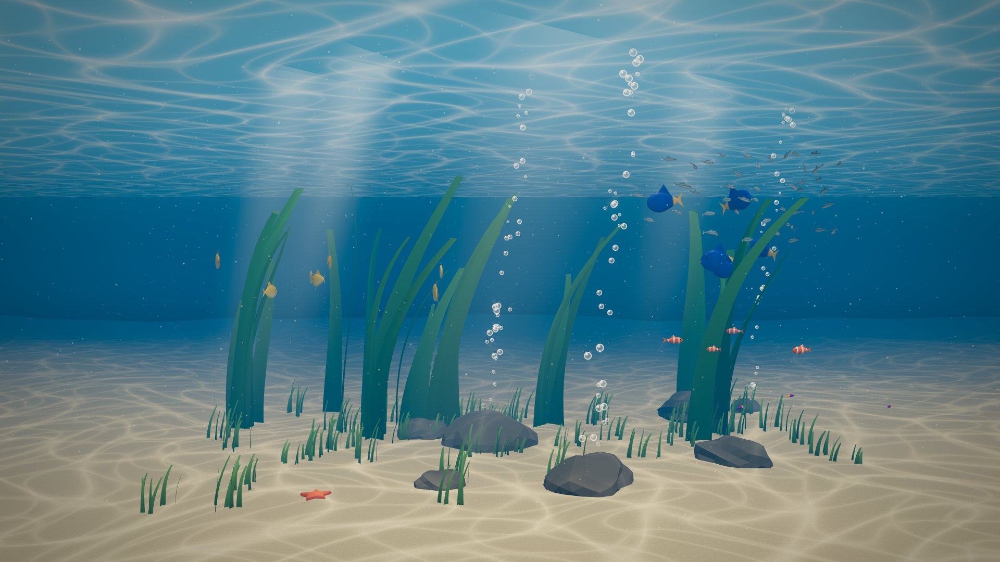

# Aquaria

A real-time 3D aquarium for the browser, built for large screens: from a
Full HD monitor up to a 4K LED wall. Every tank is described in a JSON file
(water, light, current, plants, rocks and fish), and the engine brings it to
life with Three.js.



## Features

- **Full 3D tank** seen through the glass: the camera frames the front of the
  tank to fill any screen, like a window into the water.
- **Caustics** on the sand, rocks, plants and fish, a rippling surface seen
  from below, light shafts, marine snow and rising bubbles.
- **Living fauna**: boids-based schooling, species habitats across five depth
  bands, 1 to 50 individuals per species with natural size variation. New fish
  swim in from the sides; surplus fish swim away instead of vanishing.
- **Shared water current** that bends the plants, drifts the particles and
  nudges the fish.
- **Resolution slider** from 540p to 4K, independent of the screen size, with
  Full HD and 4K presets.
- **Made for LED walls**: dithering against banding in dark gradients, no
  permanent on-screen elements, full-screen kiosk use.
- **Data-driven**: adding a scene or a species means writing JSON, not code.

## Getting started

Requirements: Node.js 22 and pnpm.

```bash
pnpm install
pnpm dev          # open the printed URL
```

Controls:

| Key / action   | Effect                              |
| -------------- | ----------------------------------- |
| `H`            | Show or hide the control panel      |
| `F`            | Toggle full screen                  |
| Move the mouse | Shows the panel button for a moment |

URL options:

| Option   | Example       | Effect                                     |
| -------- | ------------- | ------------------------------------------ |
| `scene`  | `?scene=reef` | Loads `public/scenes/<scene>.json`         |
| `seed`   | `?seed=7`     | Overrides the scene's random seed          |
| `frozen` | `?frozen=10`  | Simulates 10 s and renders one still frame |

Panel settings (populations, resolution, fps counter) are saved in the browser.

## Running on a wall

Build once, serve the `dist` folder and open it in Chrome in kiosk mode:

```bash
pnpm build
pnpm preview --host
chrome --kiosk --autoplay-policy=no-user-gesture-required http://localhost:4173
```

Disable sleep and the OS screen saver on the machine driving the wall. Start
at 4K, compare with Full HD from your usual viewing distance, and keep the
lowest setting you cannot tell apart: it saves GPU power.

## Writing scenes

A scene lives in `public/scenes/<id>.json`. The tank is measured in meters:
`x` across the glass, `y` from the sand up to the surface, `z` away from the
glass. Depth is divided into five bands, 0 right behind the glass and 4 at the
back.

```jsonc
{
  "id": "reef",
  "name": "Tropical reef",
  "seed": 20260929,
  "tank": { "width": 5.4, "height": 3, "depth": 4 },
  "water": { "color": "#0a5a7a", "fogDensity": 0.13 },
  "light": { "color": "#fff4dc", "intensity": 1.3, "caustics": { "intensity": 0.9, "scale": 1.4 } },
  "current": { "direction": [1, 0, 0.2], "strength": 0.04, "turbulence": 0.35 },
  "backdrop": { "type": "gradient", "top": "#1a86a8", "bottom": "#021a2a" },
  "floor": { "color": "#d8c49a" },
  "flora": [
    { "kind": "kelp", "count": 10, "bands": [3, 4], "height": [1.4, 2.7], "color": "#5a9a3e" },
  ],
  "props": [{ "kind": "starfish", "count": 1, "color": "#e8612c" }],
  "fauna": [{ "species": "sardine", "count": 45 }],
}
```

Species are defined once in `public/species.json`: body shape (`disc`, `round`,
`slender`), color pattern (`belly`, `tail`, `bands`, `split`), size, speed,
schooling (0 = solitary, 1 = tight school), depth bands and height range.
Files are validated on load; mistakes are reported with the exact field.

## Development

```bash
pnpm test           # unit tests (Vitest)
pnpm test:coverage  # with coverage thresholds
pnpm test:e2e       # browser tests (Playwright, software WebGL)
pnpm test:visual    # pixel comparison of a frozen frame (on demand)
pnpm lint
pnpm typecheck
pnpm build
```

The code is layered (`core` → `scene` → `sim` → `render`/`ui` → `app`), and
simulation logic runs without a browser so it can be developed test-first.
Read [AGENTS.md](AGENTS.md) before contributing: it covers architecture, TDD
rules, code quality and performance rules.

## Roadmap

- More scenes: Mediterranean seagrass, jellyfish room, shark tunnel, dolphin pool.
- glTF fish models alongside the procedural bodies.
- Layered image backdrops with parallax.
- Depth of field and a WebGPU renderer.
- Interaction: phone remote (feeding, tapping the glass), webcam presence,
  head-tracked perspective.

## License

Code: [MIT](LICENSE). Third-party assets, when added, are listed with their
licenses in [ASSETS.md](ASSETS.md).
