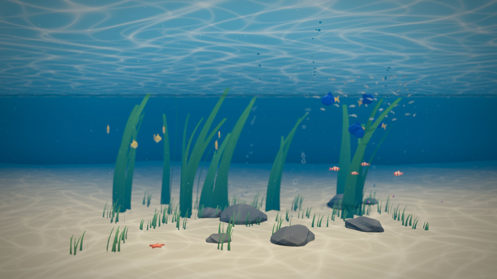

# Aquaria

A real-time 3D aquarium for the browser, built for large screens: from a
Full HD monitor up to a 4K LED wall. Every tank is described in a JSON file
(water, light, current, plants, rocks and fish), and the engine brings it to
life with Three.js.



<sub>With most effects on. A lighter setup is in
[docs/screenshot.jpg](docs/screenshot.jpg).</sub>

## Features

- **Full 3D tank** seen through the glass: the camera frames the front of the
  tank to fill any screen, like a window into the water.
- **Caustics** on the sand, rocks, plants and fish, a rippling surface seen
  from below, light shafts, marine snow and rising bubbles.
- **Living fauna**: boids-based schooling, species habitats across five depth
  bands, 1 to 50 individuals per species with natural size variation. New fish
  swim in from the sides; surplus fish swim away instead of vanishing.
- **Shared water current** that bends the plants, drifts the particles and
  nudges the fish.
- **Resolution slider** from 540p to 4K, independent of the screen size, with
  Full HD and 4K presets.
- **Made for LED walls**: dithering against banding in dark gradients, no
  permanent on-screen elements, full-screen kiosk use.
- **Every effect is a switch**: turn caustics, shadows, water reflections,
  refractive bubbles, ambient occlusion, volumetric light, depth of field,
  bloom and more on or off live from the panel, and add new effects without
  touching the rest of the engine.
- **Data-driven**: adding a scene or a species means writing JSON, not code.

## Getting started

Requirements: Node.js 22 and pnpm.

```bash
pnpm install
pnpm dev          # open the printed URL
```

Controls:

| Key / action   | Effect                              |
| -------------- | ----------------------------------- |
| `H`            | Show or hide the control panel      |
| `F`            | Toggle full screen                  |
| Move the mouse | Shows the panel button for a moment |

URL options:

| Option    | Example                  | Effect                                             |
| --------- | ------------------------ | -------------------------------------------------- |
| `scene`   | `?scene=reef`            | Loads `public/scenes/<scene>.json`                 |
| `seed`    | `?seed=7`                | Overrides the scene's random seed                  |
| `frozen`  | `?frozen=10`             | Simulates 10 s and renders one still frame         |
| `effects` | `?effects=shadows,bloom` | Enables exactly these effects (`none` for all off) |

Panel settings (populations, scenery, effects, resolution, fps counter) are saved in the browser.

## Running on a wall

Build once, serve the `dist` folder and open it in Chrome in kiosk mode:

```bash
pnpm build
pnpm preview --host
chrome --kiosk --autoplay-policy=no-user-gesture-required http://localhost:4173
```

Disable sleep and the OS screen saver on the machine driving the wall. Start
at 4K, compare with Full HD from your usual viewing distance, and keep the
lowest setting you cannot tell apart: it saves GPU power.

## Writing scenes

A scene lives in `public/scenes/<id>.json`. The tank is measured in meters:
`x` across the glass, `y` from the sand up to the surface, `z` away from the
glass. Depth is divided into five bands, 0 right behind the glass and 4 at the
back.

```jsonc
{
  "id": "reef",
  "name": "Tropical reef",
  "seed": 20260929,
  "tank": { "width": 5.4, "height": 3, "depth": 4 },
  "water": { "color": "#0a5a7a", "fogDensity": 0.13 },
  "light": { "color": "#fff4dc", "intensity": 1.3, "caustics": { "intensity": 0.9, "scale": 1.4 } },
  "current": { "direction": [1, 0, 0.2], "strength": 0.04, "turbulence": 0.35 },
  "backdrop": { "type": "gradient", "top": "#1a86a8", "bottom": "#021a2a" },
  "floor": { "color": "#d8c49a" },
  "flora": [
    { "kind": "kelp", "count": 10, "bands": [3, 4], "height": [1.4, 2.7], "color": "#5a9a3e" },
  ],
  "props": [
    { "kind": "brain-coral", "count": 4, "color": "#b8a05a" },
    { "kind": "starfish", "count": 1, "color": "#e8612c" },
  ],
  "fauna": [{ "species": "sardine", "count": 45 }],
}
```

Scenery entries:

- `flora` kinds: `kelp`, `seagrass`, `anemone` (tentacles that sway with the
  current). Each entry sets `count`, depth `bands`, `height` range and `color`.
- `props` kinds: `rock`, `starfish`, `shell`, `brain-coral`, `branch-coral`,
  `fan-coral`. Each entry sets `count` and `color`; `bands` is optional (small
  things default to the front, sea fans to the back).
- The floor and any prop entry may set a photographic `material`:
  `{ "id": "reef-rock", "tileSize": 0.45, "displacement": 0.07 }`. The id is a
  folder in `public/assets/materials/` with `normal.ktx2` and `surface.ktx2`;
  `tileSize` is the size of one texture tile in meters and `displacement`
  pushes the surface out by up to that many meters. The entry's `color` still
  sets the hue. A missing material logs a warning and falls back to the plain
  color. Available: `fine-sand`, `reef-rock`.
- Any entry may have a `name`, used as its label in the panel. Every entry
  gets a slider in the panel's Scenery section; adding items never moves the
  ones already placed.

Species are defined once in `public/species.json`: body shape (`disc`, `round`,
`slender`), color pattern (`belly`, `tail`, `bands`, `split`), size, speed,
schooling (0 = solitary, 1 = tight school), depth bands and height range.
Files are validated on load; mistakes are reported with the exact field.

## Effects

Every effect has its own switch in the control panel (press `H`), so you
choose what the GPU spends its time on.

| Switch              | What it does                                         | Default |
| ------------------- | ---------------------------------------------------- | ------- |
| Caustics            | Moving web of light on sand, rocks, plants and fish  | on      |
| Shadows             | Sun shadows of fish, rocks and plants                | on      |
| Water reflections   | Image-based light from the water around the tank     | on      |
| Refractive bubbles  | Glass-like bubbles instead of sprites                | on      |
| Light shaft planes  | Cheap shafts; redundant with volumetric light        | off     |
| Ambient occlusion   | Darkens creases and contact areas                    | off     |
| Volumetric light    | Shafts through the water, occluded by fish and kelp  | on      |
| Depth of field      | Blurs what is nearer or further than the focus plane | off     |
| Bloom               | Soft glow around the brightest pixels                | on      |
| Vignette and dither | Darker corners; dither against banding on LED walls  | on      |

Ambient occlusion is by far the most expensive (about 18 ms per frame at
1080p on a mid-range GPU) and depth of field looks like blur on a wall seen
with the naked eye, so both start off. Watch the fps counter while you
switch: on the wall, keep the set that stays at 60 fps.

Each effect's parameters and ranges are documented, with their tuned
defaults, in `src/render/effects/`. To add a new effect: create a file there
with `defineEffect` (id, panel name, stage, default on/off, Zod parameter
schema with defaults, `create` returning a Three.js pass), and add it to
`EFFECTS` in `src/render/effects/index.ts`. It appears in the panel; nothing
else in the engine changes.

## Materials

Surface textures are KTX2 files: they stay compressed on the GPU, about a
quarter of the memory of PNG or WebP, which matters at 4K. They are built
from CC0 sources by a script:

```bash
python scripts/build_materials.py            # all materials
python scripts/build_materials.py reef-rock  # just one
```

It needs Python 3 with Pillow and NumPy, and KTX-Software's `ktx` tool. Either
install KTX-Software, or extract its release into the ignored `tools/ktx/`
folder, for example on Windows:

```bash
7z x KTX-Software-4.4.2-Windows-x64.exe -otools/ktx
```

To add a material, add its source to `MATERIALS` in the script, run it, list
the source in `ASSETS.md` and use its id in a scene.

## Development

```bash
pnpm test           # unit tests (Vitest)
pnpm test:coverage  # with coverage thresholds
pnpm test:e2e       # browser tests (Playwright, software WebGL)
pnpm test:visual    # pixel comparison of a frozen frame (on demand)
pnpm lint
pnpm typecheck
pnpm build
```

The code is layered (`core` → `scene` → `sim` → `render`/`ui` → `app`), and
simulation logic runs without a browser so it can be developed test-first.
Read [AGENTS.md](AGENTS.md) before contributing: it covers architecture, TDD
rules, code quality and performance rules.

## Roadmap

- More scenes: Mediterranean seagrass, jellyfish room, shark tunnel, dolphin pool.
- Layered image backdrops with parallax.
- glTF fish (e.g. the CC0 Quaternius animated fish) and a WebGPU renderer.
- Interaction: phone remote (feeding, tapping the glass), webcam presence,
  head-tracked perspective.

## License

Code: [MIT](LICENSE). Third-party assets, when added, are listed with their
licenses in [ASSETS.md](ASSETS.md).
